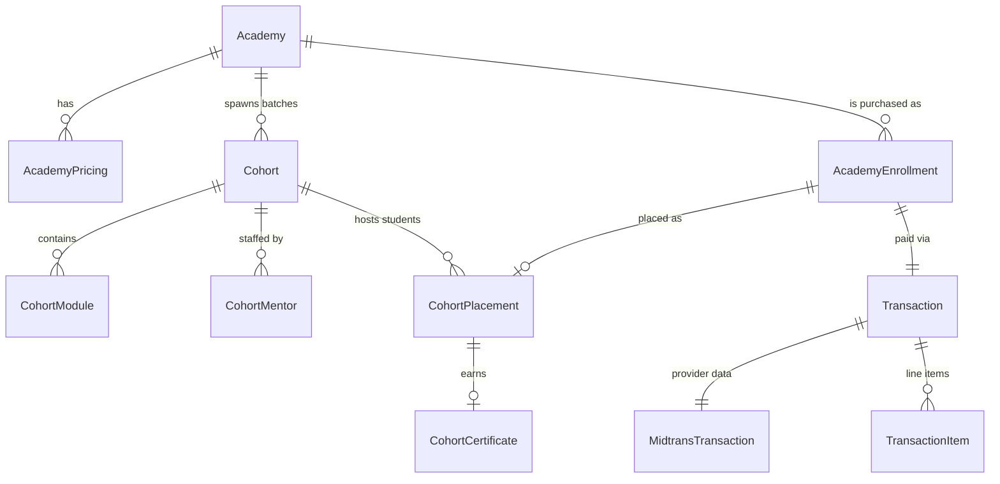
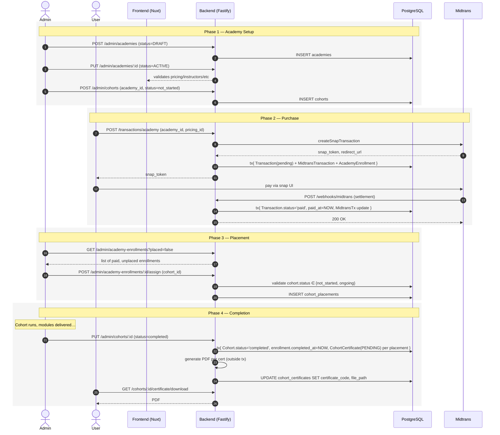
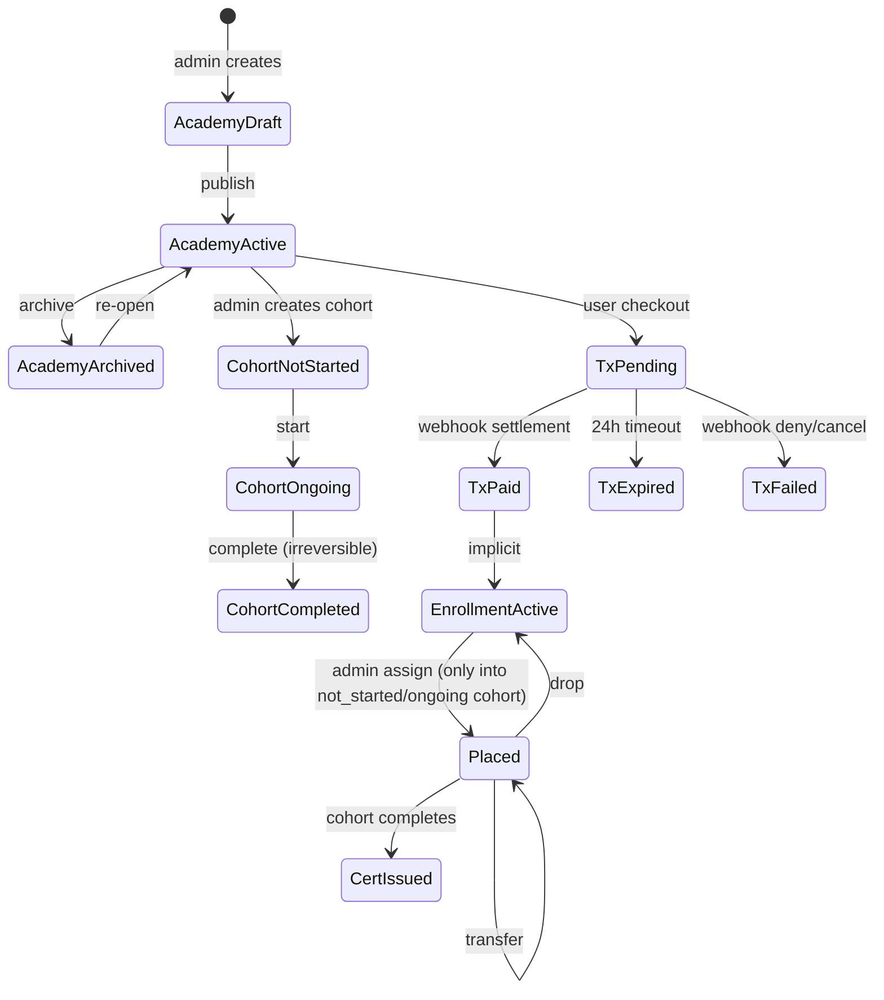

# Transaction × Academy × Cohort — Lifecycle & Touchpoints

Dokumen ini menjelaskan siklus hidup tiga entitas inti di Rise LMS dan titik-titik di mana mereka saling berhubungan. Tujuan: memberi gambaran end-to-end dari admin membuat academy → user beli & bayar → admin assign ke cohort → cohort selesai → certificate terbit.

> Semua referensi kode di-anchor ke path absolut dari root repo.

---

## 1. Entitas Inti

| Entitas              | Tabel                 | Peran                                                                                |
| -------------------- | --------------------- | ------------------------------------------------------------------------------------ |
| `Academy`            | `academies`           | Produk pembelajaran (template). Punya pricing, syllabus, FAQ, dst.                   |
| `Cohort`             | `cohorts`             | Batch/kelas konkret dari sebuah academy. Ada start/end date, mentor, modul.          |
| `Transaction`        | `transactions`        | **Layer 1** — payment record provider-agnostic.                                      |
| `MidtransTransaction`| `midtrans_transactions` | **Layer 2** — data spesifik provider (snap token, VA, dll).                        |
| `AcademyEnrollment`  | `academy_enrollments` | **Layer 3** — bukti user beli academy. Parent dari `CohortPlacement`.                |
| `CohortPlacement`    | `cohort_placements`   | Penempatan student ke cohort spesifik (admin-assigned). Anak dari `AcademyEnrollment`.|
| `CohortCertificate`  | `cohort_certificates` | Sertifikat per `CohortPlacement` saat cohort `completed`.                            |

Skema lengkap: [`backend/prisma/schema.prisma`](../prisma/schema.prisma).

---

## 2. Lifecycle per Entitas

### 2.1 Academy

```
DRAFT ──(publish)──▶ ACTIVE ──(archive)──▶ ARCHIVED
  ▲                     │
  └────(switch back)────┘
```

| Status     | Arti                                                                |
| ---------- | ------------------------------------------------------------------- |
| `DRAFT`    | Sedang disusun. Tidak muncul di public, tidak bisa dibeli.          |
| `ACTIVE`   | Public-visible & bisa dibeli. Cohort tidak harus ada saat publish — admin bisa buat cohort sambil jalan, dan placement dilakukan setelah student bayar. |
| `ARCHIVED` | Hilang dari katalog public, transaksi baru ditolak.                 |

**Transisi & guard:**
- `PUT /admin/academies/:id` mengubah status — saat naik ke `ACTIVE`, frontend memvalidasi kelengkapan (pricing ≥1, instructor ≥1, dst — lihat `frontend-v2/app/pages/admin/academies/[slug]/edit.vue:208`).
- `POST /transactions/academy` menolak academy non-`ACTIVE` (`backend/src/services/user/academyPaymentService.js:14`).
- `DELETE /admin/academies/:id` ditolak (HTTP 409) bila masih ada cohort terkait — guard di `backend/src/services/admin/academyService.js:91`.

### 2.2 Cohort

**Stored**: `cohort.status` di DB hanya punya 1 nilai operasional yang bermakna: `'completed'`. Nilai legacy `'not_started'` & `'ongoing'` masih bisa exist di DB, tapi diperlakukan identik (= "active / not completed") oleh semua logic. Admin **tidak** lagi toggle `not_started ↔ ongoing` manual.

**Visual phase** di-derive lewat `getCohortPhase(cohort)` (`backend/src/utils/cohortPhase.js`, `frontend-v2/app/utils/cohort.ts`):

```js
if (cohort.status === 'completed') return 'completed'
if (cohort.start_date && now < cohort.start_date) return 'not_started'
return 'ongoing'
```

| Phase         | Arti                                                              |
| ------------- | ----------------------------------------------------------------- |
| `not_started` | `start_date` di masa depan.                                       |
| `ongoing`     | Sudah lewat `start_date` (atau `start_date` null).                |
| `completed`   | `status === 'completed'`. Trigger certificate generation (irreversible). |

**Transisi & guard:**
- `POST /admin/cohorts/:id/complete` — endpoint dedicated yang menjalankan `completeCohort()` di `backend/src/services/admin/cohortService.js:98`. Generate `CohortCertificate` + PDF untuk setiap `CohortPlacement`, set `AcademyEnrollment.completed_at`. Idempotent.
- `PUT /admin/cohorts/:id` **tidak** terima field `status` — UI tidak lagi expose toggling.
- `assignToCohort` menolak (422) hanya kalau `status === 'completed'` (`backend/src/services/admin/placementService.js`).

### 2.3 Transaction (3-Layer Payment)

```
pending ──▶ paid       (settlement / capture)
        ──▶ failed     (deny / cancel)
        ──▶ expired    (expire timeout, default 24 jam)
        ──▶ cancelled  (admin / user cancel)
        ──▶ refunded   (refund)
```

Status dipetakan dari Midtrans ke generic status di `backend/src/constants/paymentHelpers.js:11` (`mapMidtransStatus`).

**Transisi:**
- Buat: `POST /transactions/academy` → service `createTransaction` membuat 3 layer dalam satu Prisma transaction (`backend/src/services/user/academyPaymentService.js:106-232`).
- Update: webhook Midtrans (`POST /webhooks/midtrans`) → `WebhookController.handleMidtransWebhook` mengupdate Layer 1 + Layer 2 + (kalau RYLS) Layer 3 dalam satu DB transaction (`backend/src/controllers/shared/webhookController.js:43`).
- `Transaction.expired_at` default 24 jam dari pembuatan (`academyPaymentService.js:189`). Kalau user mau bayar lagi setelah expired, transaction lama di-`cancelled` dan baru dibuat tanpa membuat ulang `AcademyEnrollment` (line 51-57).

### 2.4 AcademyEnrollment

`AcademyEnrollment` **tidak punya kolom status sendiri**. Status diturunkan dari `transaction.status`:

| Kondisi                                              | Interpretasi                            |
| ---------------------------------------------------- | --------------------------------------- |
| `transaction.status='pending'`, no `placement`       | Menunggu pembayaran                      |
| `transaction.status='paid'`, no `placement`          | Aktif, menunggu admin assign            |
| `transaction.status='paid'`, has `placement`         | Aktif, ditempatkan di cohort            |
| `transaction.status='paid'`, `completed_at` ≠ null   | Sudah lulus dari cohort                 |
| `transaction.status='expired'/'failed'/'cancelled'`  | Tidak aktif (boleh re-create transaksi) |

**Lifecycle:**
- Dibuat **saat checkout** bersama Transaction (`academyPaymentService.js:217`).
- `completed_at` di-set saat cohort yang menampung `placement` di-`completed` (`cohortService.js:131`).
- Dihapus secara cascade saat `Academy` dihapus (lihat Section 3.2).

### 2.5 CohortPlacement

```
(no placement) ──assign──▶ placed ──transfer──▶ placed (cohort lain)
                              │
                              └──drop──▶ (no placement)
                                          AcademyEnrollment tetap aktif
```

- Constraint unik: `[cohort_id, user_id]` dan `academy_enrollment_id` (1:1 ke enrollment).
- **Assign** baru atau ganti cohort: `assignToCohort` (`placementService.js:57`). Kalau placement sudah ada, dipindah pakai `replacePlacement` (atomic).
- **Transfer**: tidak ada endpoint khusus — panggil `assignToCohort` lagi dengan cohort_id baru. Service mendeteksi placement existing dan atomic-replace via `replacePlacement`.
- **Drop**: `dropPlacement` (`placementService.js:106`) — placement dihapus tapi enrollment tetap. Student bisa di-assign ulang nanti.

### 2.6 CohortCertificate

- Dibuat oleh `completeCohort()` saat cohort di-set `completed`.
- 1:1 dengan `CohortPlacement` (`placement_id @unique`).
- Dua tahap: row dibuat dengan `certificate_code: 'PENDING-…'` di dalam DB transaction, lalu PDF di-generate dan kode final + `file_path` di-update di luar transaction (`cohortService.js:160-182`).

---

## 3. Touchpoints — Di Mana Mereka Berhubungan

### 3.1 Foreign Key Map



### 3.2 Cascade Delete Behavior

Saat `Academy.delete` dipanggil (sekarang di-guard kalau ada cohort), berikut yang ter-cascade ke turunan:

```
Academy ──cascade──▶ Cohort ──cascade──▶ CohortModule ──cascade──▶ CohortAssignmentCompletion
                                       └▶ CohortModuleAttachment
                                       └▶ CohortMentor
                                       └▶ CohortPlacement ──cascade──▶ CohortCertificate
                                       └▶ CohortCertificate
        └──cascade──▶ AcademyEnrollment ──cascade──▶ CohortPlacement (jalur lain)
        └──cascade──▶ AcademyPricing/Feature/Theme/Topic/Instructor/Testimonial/Faq
        └──setNull──▶ FileUpload.academy_id
```

> **Catatan**: `CohortMentor.academy_id` dan `CohortCertificate.academy_id` di-default `Restrict`. Aman karena cascade dari `Cohort` lebih dulu menghapus row, tapi rapuh secara desain (lihat [`cohort-placement-refactor-design.md`](./cohort-placement-refactor-design.md)).

---

## 4. End-to-End Happy Path



---

## 5. State Diagram — Joint View



---

## 6. Touchpoint Summary Table

| Event                                  | Tabel yang berubah                                                   | Code path                                                                |
| -------------------------------------- | -------------------------------------------------------------------- | ------------------------------------------------------------------------ |
| User checkout                          | `transactions`, `transaction_items`, `midtrans_transactions`, `academy_enrollments` | `services/user/academyPaymentService.js:createTransaction`               |
| Midtrans settlement webhook            | `transactions.status='paid'`, `midtrans_transactions`                | `controllers/shared/webhookController.js:handleMidtransWebhook`          |
| Midtrans expire/deny webhook           | `transactions.status='expired'/'failed'`                             | sda                                                                      |
| Re-checkout after expiry               | old `Transaction.status='cancelled'`, new `Transaction`+`MidtransTx`, reuse `AcademyEnrollment` | `academyPaymentService.js:51-57,84-149`                                  |
| Admin assign placement                 | `cohort_placements` insert (atau atomic replace untuk re-assign)     | `services/admin/placementService.js:assignToCohort`                       |
| Admin drop placement                   | `cohort_placements` delete                                           | `placementService.js:dropPlacement`                                       |
| Cohort completion                      | `cohorts.status='completed'`, `academy_enrollments.completed_at`, `cohort_certificates` insert + PDF | `services/admin/cohortService.js:completeCohort`                          |
| Academy delete (no cohort)             | cascade ke pricing/feature/theme/instructor/etc + `academy_enrollments` (yang punya placement → cert) | `services/admin/academyService.js:deleteAcademy`                          |
| Academy delete (has cohort)            | **Ditolak — HTTP 409**                                               | sda                                                                      |

---

## 7. Referensi

- Skema DB: [`prisma/schema.prisma`](../prisma/schema.prisma)
- Cohort placement refactor design: [`cohort-placement-refactor-design.md`](./cohort-placement-refactor-design.md)
- DB schema canonical doc: [`Rise_LMS_Database_Schema_Cohort_v3.md`](./Rise_LMS_Database_Schema_Cohort_v3.md)
- Implementation guide: [`Rise_LMS_Cohort_Implementation_Guide.md`](./Rise_LMS_Cohort_Implementation_Guide.md)
