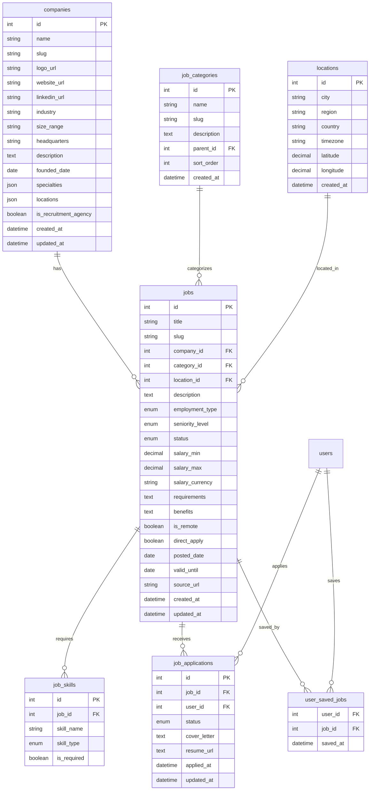

# 🏢 Jobs Database Schema Recommendation

## 📊 Schema Overview



## 🗂️ Detailed Table Structures

### 1. **companies** - Master perusahaan
```sql
CREATE TABLE companies (
    id SERIAL PRIMARY KEY,
    name VARCHAR(255) NOT NULL,
    slug VARCHAR(255) UNIQUE NOT NULL,
    logo_url VARCHAR(500),
    website_url VARCHAR(500),
    linkedin_url VARCHAR(500),
    linkedin_slug VARCHAR(255),
    
    -- Company info
    industry VARCHAR(255),
    size_range VARCHAR(100), -- "2-10", "501-1000", "10000+"
    headquarters VARCHAR(255),
    description TEXT,
    founded_date DATE,
    slogan VARCHAR(500),
    
    -- Additional metadata  
    specialties JSON, -- Array of specialties
    locations JSON,   -- Array of office locations
    employee_count INTEGER,
    follower_count INTEGER,
    
    -- Flags
    is_recruitment_agency BOOLEAN DEFAULT FALSE,
    is_verified BOOLEAN DEFAULT FALSE,
    
    -- Timestamps
    created_at TIMESTAMP NOT NULL DEFAULT CURRENT_TIMESTAMP,
    updated_at TIMESTAMP NOT NULL DEFAULT CURRENT_TIMESTAMP ON UPDATE CURRENT_TIMESTAMP
);

-- Indexes
CREATE INDEX idx_companies_slug ON companies(slug);
CREATE INDEX idx_companies_industry ON companies(industry);
CREATE INDEX idx_companies_size ON companies(size_range);
```

### 2. **job_categories** - Kategori pekerjaan dengan hierarki
```sql
CREATE TABLE job_categories (
    id SERIAL PRIMARY KEY,
    name VARCHAR(255) NOT NULL,
    slug VARCHAR(255) UNIQUE NOT NULL,
    description TEXT,
    parent_id INTEGER REFERENCES job_categories(id),
    sort_order INTEGER DEFAULT 0,
    created_at TIMESTAMP NOT NULL DEFAULT CURRENT_TIMESTAMP
);

-- Sample data:
-- Technology > Software Development > Frontend
-- Healthcare > Medical > Pharmacy
-- Marketing > Digital Marketing > Social Media
```

### 3. **locations** - Master lokasi dengan koordinat
```sql
CREATE TABLE locations (
    id SERIAL PRIMARY KEY,
    city VARCHAR(255),
    region VARCHAR(255),
    country VARCHAR(255) NOT NULL,
    timezone VARCHAR(100),
    latitude DECIMAL(10, 8),
    longitude DECIMAL(11, 8),
    created_at TIMESTAMP NOT NULL DEFAULT CURRENT_TIMESTAMP,
    
    UNIQUE(city, region, country)
);

-- Indexes
CREATE INDEX idx_locations_country ON locations(country);
CREATE INDEX idx_locations_region ON locations(region);
CREATE INDEX idx_locations_coordinates ON locations(latitude, longitude);
```

### 4. **jobs** - Main jobs table
```sql
CREATE TYPE employment_type AS ENUM (
    'full_time', 'part_time', 'contract', 'temporary', 
    'internship', 'freelance', 'volunteer'
);

CREATE TYPE seniority_level AS ENUM (
    'entry_level', 'associate', 'mid_senior', 
    'director', 'executive'
);

CREATE TYPE job_status AS ENUM (
    'draft', 'active', 'paused', 'closed', 'expired'
);

CREATE TABLE jobs (
    id SERIAL PRIMARY KEY,
    title VARCHAR(255) NOT NULL,
    slug VARCHAR(255) NOT NULL,
    
    -- Relations
    company_id INTEGER NOT NULL REFERENCES companies(id),
    category_id INTEGER REFERENCES job_categories(id),
    location_id INTEGER REFERENCES locations(id),
    
    -- Job details
    description TEXT NOT NULL,
    employment_type employment_type NOT NULL DEFAULT 'full_time',
    seniority_level seniority_level DEFAULT 'entry_level',
    status job_status NOT NULL DEFAULT 'active',
    
    -- Salary info
    salary_min INTEGER,
    salary_max INTEGER, 
    salary_currency VARCHAR(3) DEFAULT 'IDR',
    salary_period VARCHAR(20) DEFAULT 'monthly', -- monthly, annual
    
    -- Requirements & Benefits
    requirements TEXT,
    responsibilities TEXT,
    benefits TEXT,
    
    -- Work arrangement
    is_remote BOOLEAN DEFAULT FALSE,
    remote_policy VARCHAR(100), -- "fully_remote", "hybrid", "office_only"
    
    -- Application
    direct_apply BOOLEAN DEFAULT TRUE,
    external_url VARCHAR(500),
    application_deadline DATE,
    
    -- Dates
    posted_date DATE NOT NULL DEFAULT CURRENT_DATE,
    valid_until DATE,
    
    -- Source tracking
    source VARCHAR(100), -- "linkedin", "manual", "api"
    source_url VARCHAR(500),
    external_id VARCHAR(255), -- LinkedIn job ID, etc.
    
    -- SEO
    meta_title VARCHAR(255),
    meta_description VARCHAR(500),
    
    -- Timestamps
    created_at TIMESTAMP NOT NULL DEFAULT CURRENT_TIMESTAMP,
    updated_at TIMESTAMP NOT NULL DEFAULT CURRENT_TIMESTAMP ON UPDATE CURRENT_TIMESTAMP,
    
    UNIQUE(company_id, slug)
);

-- Indexes for performance
CREATE INDEX idx_jobs_company ON jobs(company_id);
CREATE INDEX idx_jobs_category ON jobs(category_id);
CREATE INDEX idx_jobs_location ON jobs(location_id);
CREATE INDEX idx_jobs_status ON jobs(status);
CREATE INDEX idx_jobs_employment_type ON jobs(employment_type);
CREATE INDEX idx_jobs_posted_date ON jobs(posted_date DESC);
CREATE INDEX idx_jobs_salary ON jobs(salary_min, salary_max);
CREATE INDEX idx_jobs_remote ON jobs(is_remote);

-- Full text search
CREATE INDEX idx_jobs_search ON jobs USING gin(to_tsvector('english', title || ' ' || description));
```

### 5. **job_skills** - Skills requirements
```sql
CREATE TYPE skill_type AS ENUM ('technical', 'soft', 'language', 'certification');

CREATE TABLE job_skills (
    id SERIAL PRIMARY KEY,
    job_id INTEGER NOT NULL REFERENCES jobs(id) ON DELETE CASCADE,
    skill_name VARCHAR(255) NOT NULL,
    skill_type skill_type DEFAULT 'technical',
    is_required BOOLEAN DEFAULT TRUE,
    experience_years INTEGER,
    
    INDEX(job_id),
    INDEX(skill_name)
);
```

### 6. **job_applications** - User applications tracking
```sql
CREATE TYPE application_status AS ENUM (
    'pending', 'reviewed', 'interviewed', 'rejected', 
    'accepted', 'withdrawn'
);

CREATE TABLE job_applications (
    id SERIAL PRIMARY KEY,
    job_id INTEGER NOT NULL REFERENCES jobs(id),
    user_id INTEGER NOT NULL REFERENCES users(id),
    status application_status NOT NULL DEFAULT 'pending',
    
    -- Application data
    cover_letter TEXT,
    resume_url VARCHAR(500),
    portfolio_url VARCHAR(500),
    
    -- Process tracking
    applied_at TIMESTAMP NOT NULL DEFAULT CURRENT_TIMESTAMP,
    reviewed_at TIMESTAMP,
    responded_at TIMESTAMP,
    
    updated_at TIMESTAMP NOT NULL DEFAULT CURRENT_TIMESTAMP ON UPDATE CURRENT_TIMESTAMP,
    
    UNIQUE(job_id, user_id)
);

-- Indexes
CREATE INDEX idx_applications_job ON job_applications(job_id);
CREATE INDEX idx_applications_user ON job_applications(user_id);
CREATE INDEX idx_applications_status ON job_applications(status);
CREATE INDEX idx_applications_date ON job_applications(applied_at DESC);
```

### 7. **user_saved_jobs** - Favorite/saved jobs
```sql
CREATE TABLE user_saved_jobs (
    user_id INTEGER NOT NULL REFERENCES users(id) ON DELETE CASCADE,
    job_id INTEGER NOT NULL REFERENCES jobs(id) ON DELETE CASCADE,
    saved_at TIMESTAMP NOT NULL DEFAULT CURRENT_TIMESTAMP,
    
    PRIMARY KEY (user_id, job_id)
);

-- Indexes
CREATE INDEX idx_saved_jobs_user ON user_saved_jobs(user_id, saved_at DESC);
CREATE INDEX idx_saved_jobs_job ON user_saved_jobs(job_id);
```

## 🔧 Advanced Features

### 1. **Search & Filtering Queries**
```sql
-- Advanced job search with filters
SELECT j.*, c.name as company_name, c.logo_url, l.city, l.country
FROM jobs j
LEFT JOIN companies c ON j.company_id = c.id  
LEFT JOIN locations l ON j.location_id = l.id
WHERE j.status = 'active'
  AND j.valid_until > CURRENT_DATE
  AND ($title IS NULL OR j.title ILIKE '%' || $title || '%')
  AND ($company IS NULL OR c.name ILIKE '%' || $company || '%')
  AND ($location IS NULL OR l.city ILIKE '%' || $location || '%')
  AND ($employment_type IS NULL OR j.employment_type = $employment_type)
  AND ($salary_min IS NULL OR j.salary_min >= $salary_min)
  AND ($is_remote IS NULL OR j.is_remote = $is_remote)
ORDER BY j.posted_date DESC
LIMIT $limit OFFSET $offset;
```

### 2. **Recommended Jobs Algorithm**
```sql
-- Jobs recommendation based on user's saved jobs and applications
WITH user_preferences AS (
  SELECT DISTINCT j.category_id, j.employment_type, l.country
  FROM user_saved_jobs usj
  JOIN jobs j ON usj.job_id = j.id
  JOIN locations l ON j.location_id = l.id  
  WHERE usj.user_id = $user_id
),
user_skills AS (
  SELECT skill_name
  FROM job_applications ja
  JOIN job_skills js ON ja.job_id = js.job_id
  WHERE ja.user_id = $user_id
)
SELECT j.*, c.name as company_name,
       COUNT(DISTINCT js.skill_name) as matching_skills
FROM jobs j
JOIN companies c ON j.company_id = c.id
LEFT JOIN job_skills js ON j.id = js.job_id 
  AND js.skill_name IN (SELECT skill_name FROM user_skills)
WHERE j.status = 'active'
  AND j.id NOT IN (
    SELECT job_id FROM user_saved_jobs WHERE user_id = $user_id
  )
  AND (j.category_id IN (SELECT category_id FROM user_preferences)
       OR j.employment_type IN (SELECT employment_type FROM user_preferences))
GROUP BY j.id, c.name
ORDER BY matching_skills DESC, j.posted_date DESC
LIMIT 10;
```

## 🚀 Implementation Strategy

### Phase 1: Core Tables
1. companies
2. locations  
3. job_categories
4. jobs

### Phase 2: User Features
1. user_saved_jobs
2. job_applications

### Phase 3: Advanced Features
1. job_skills
2. Search optimization
3. Recommendation system

### Phase 4: Analytics & AI
1. Job view tracking
2. Application analytics
3. Salary insights
4. AI job matching

## 📈 Performance Optimizations

1. **Materialized Views** untuk aggregate data
2. **Redis Caching** untuk job listings
3. **Elasticsearch** untuk full-text search
4. **CDN** untuk company logos
5. **Database Partitioning** untuk historical data

## 🔒 Security Considerations

1. **Rate Limiting** untuk job scraping
2. **Data Anonymization** untuk applications
3. **GDPR Compliance** untuk user data
4. **API Key Management** untuk external sources

---

**Total Tables: 7 core tables**
**Estimated Records: 100K+ jobs, 10K+ companies**
**Performance: Optimized for 1M+ page views/month** 